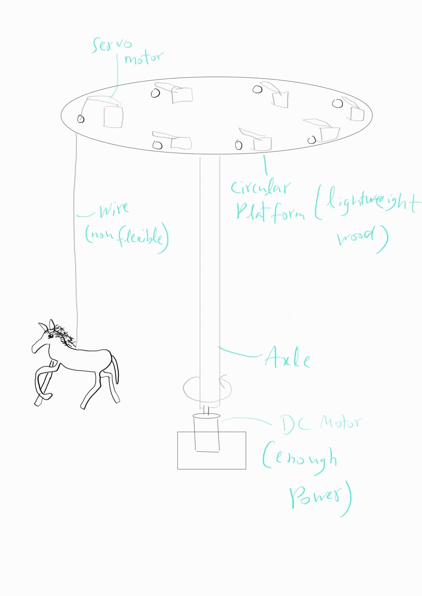
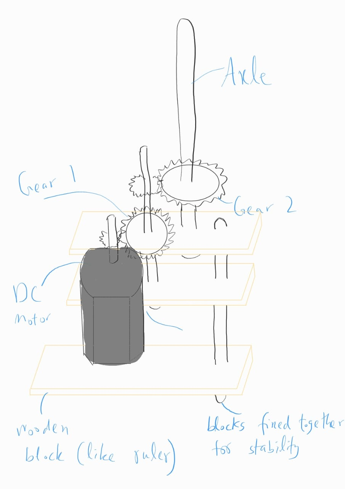

# The Carousel:
### By Ehtisham, Aya, and Evelyn 

  
## Overall Plan:

1) We plan to securely mounting a powerful DC motor to a stable base, ensuring that it is positioned vertically.
2) Then, we will attach gear to the shaft of the DC motor, and use it to provide rotational force to a vertical axle.
3) This axle is attached to a circular platform (made of cardboard, wood, or another lightweight material) to the top of the axle to serve as the base for the carousel.
4) This circular platform has holes cut out in it base for each horse. Near these holes are servo motors (small ones) one per horse or one per two horses.
5) small non-flexible wires are attached to the horses and the servo motors. The servo motors allow horses to move up and down.

## The Challenging Part:

The challenging part is to have a powerful DC motor to stay stable and rotate the axle (which has weight of circular platform, servos, and the horses).

To keep the motor stable, we need a base which we can securely mount it to. 

To rotate the axle, we figure it might require to work with gears if we find that its difficult to put the weight on motor directly and rotate it.
So, we came up with the following sketch:

